> [!NOTE]
Предварительно был установлен git.

## Введение

Был создан репозиторий git-practice.

> 

Была создана папка lab_5, куда был скопирован репозиторий git_practice.

> 

В папке репозитория был создан файл example.txt, в который был добавлен фрагмент книги с главами и параграфами.

> 

> 

При попытке запушить комит, гит просит нас ввести логин и пароль

> 

В графе пароль нужно указать personal access token, поэтому он был создан в гитхаб. https://qna.habr.com/q/1216714

> 

Теперь все успешно запушилось!

> 

Была создана ветка feature-branch. Был совершён переход в эту ветку. Был изменён файл example.txt - добавлен Chapter 3: plus more jokes!

> 

Добавлен коммит

> 
> 

Слияние ветки произошло успешно.

> 

Проверка: 

> 
> 

> [!CAUTION] 
> #### Авторизовываться при каждом пуше - неудобно. Нужно это исправить.

## Решение проблемы с авторизацией № 1
https://git-scm.com/docs/git-credential-cache

> 
> [!CAUTION] 
> #### Проблема с авторизацией никуда не делась - пробуем решить другим способом.

## Решение проблем с авторизацией №2
Установлен ## [GitHub CLI](https://docs.github.com/en/get-started/getting-started-with-git/caching-your-github-credentials-in-git#github-cli)
С помощью 
`sudo apt-key adv --keyserver keyserver.ubuntu.com --recv-key C99B11DEB97541F0`
`sudo apt-add-repository -u https://cli.github.com/packages`
`sudo apt-get update`
`sudo apt-get install gh`

> 

Теперь авторизовываться не нужно. Бинго!

> 
## Работа с ветками
Создан новый файл jokes.txt.

> 

Файл успешно запушен в главную ветку.

> 

Была создана новая ветка feature-login, где в файл были внесены изменения - добавлена Chapter 3.

> 

Ветка отправлена на гитхаб. 

> 

## Работа с удалённым репозиторием

Совершён переход в основную ветку. Изменён файл jokes.txt - добавлено название книги `JOKES AND RIDDLES!`

> 

> [!IMPORTANT]
> Так как мы в главной ветке - тут нет Chapter 3.

Изменения в файле закоммичены и отправлены на гитхаб.

> 

## Моделирование конфликта

Для моделирования конфликта был совершён переход в ветку `feature-login`, где в файле `jokes.txt` было изменено название книги на `RIDDLES AND JOKES!

> В основной ветке названием книги было `JOKES AND RIDDLES!`

> 

Изменения были закоммичены и отправлены в гитхаб.

> 

## Разрешение конфликта

Совершен переход в главную ветку. Главная ветка обновлена с помощью `pull`. Попытка слить две ветки - `git merge feature-login` - не увенчалась успехом. Возник конфликт.

> 

Необходимо почистить файл и выбрать одно из названий.

> 
> 
> 

Добавляем изменённый файл, коммитим разрешение конфликта и отправляем его на гитхаб. Бинго!

> 

## Автоматизация проверки формата файлов при коммите
Узнаём полный путь к hooks и создаём скрипт `check_format.bash`, который будет проверять .txt файлы на соответствие.
(полезная ссылка https://xakep.ru/2016/02/11/git-hook-magic/#toc02, https://semakin.dev/2020/05/pre-commit/)

> 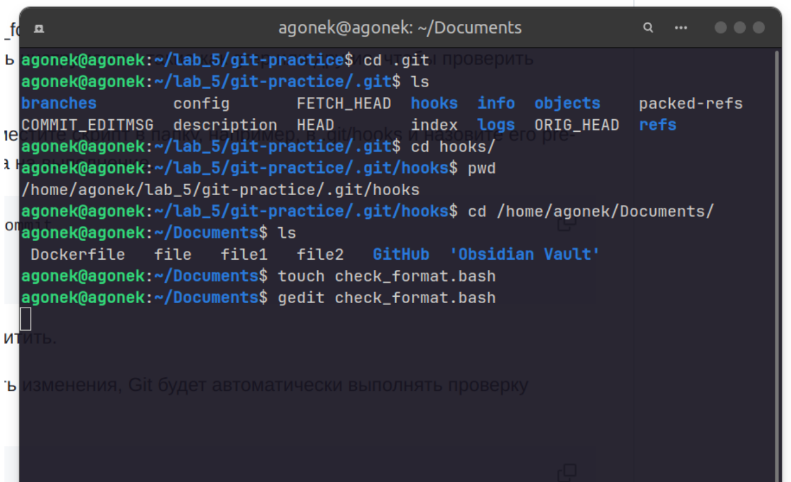
> 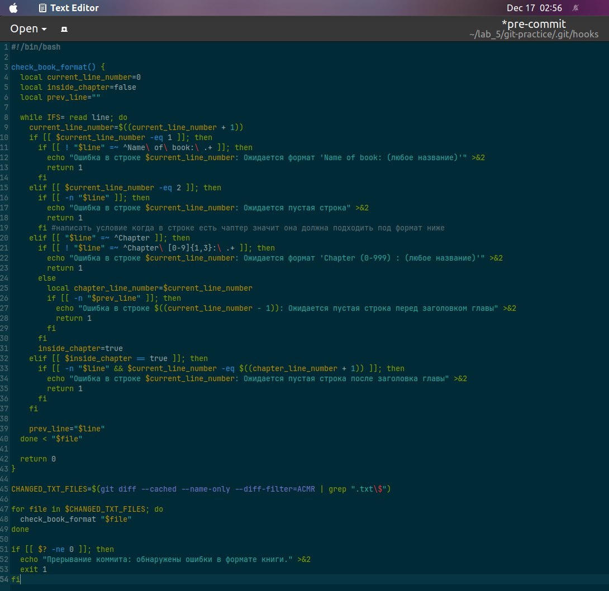

Копирование скрипта в папку с hooks, предоставление полномочий.

> 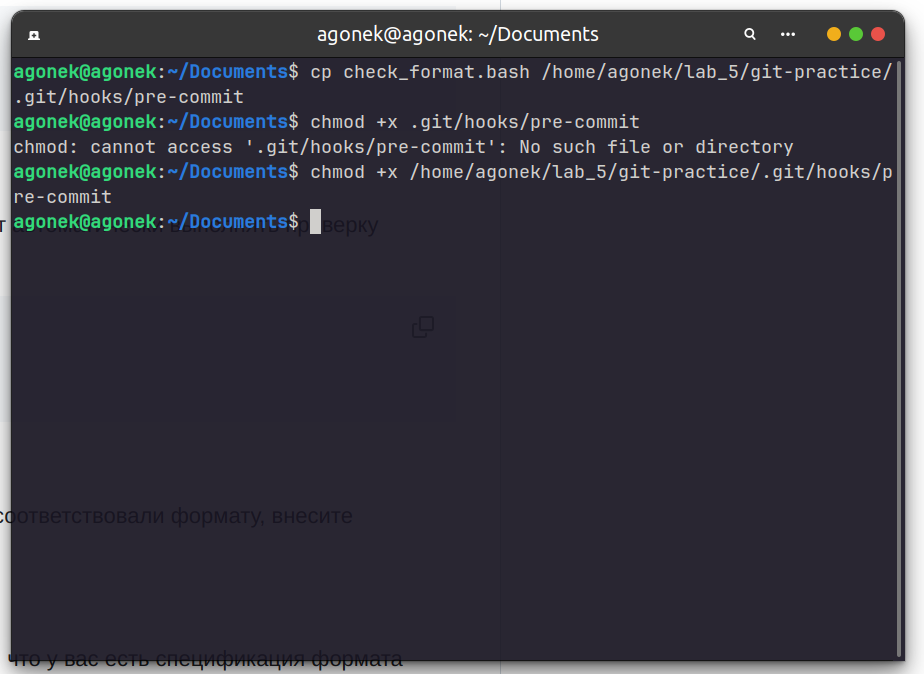

В репозиторий был скопирован файл `your_book_file.txt` (c помощью команды `cp your_book_file.txt /home/agonek/lab_5/git-practice`), в формате которого содержатся ошибки - строка после Chapter 2 должна быть пустой.

> 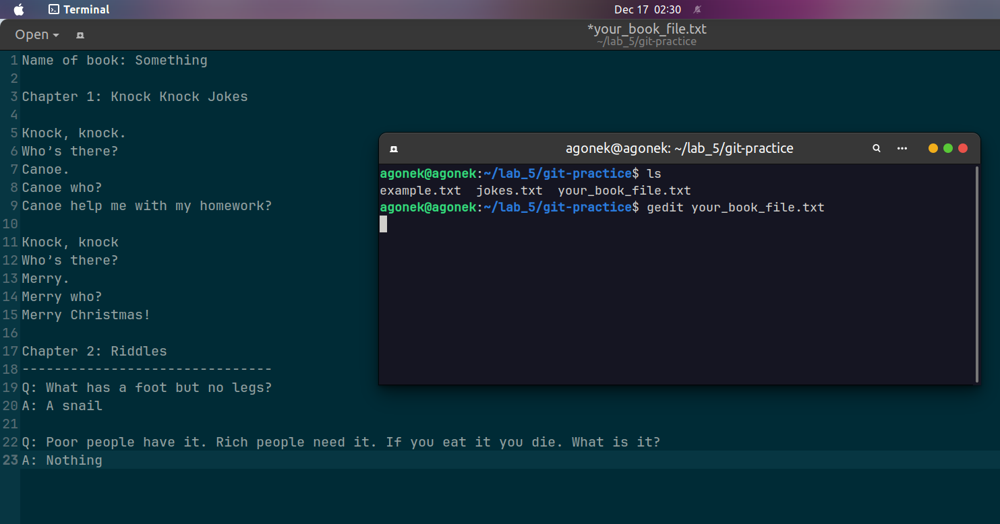

Добавляем файл в индекс, пробуем закоммитить измнения - получаем ошибку, так как файл не соответствует формату.

> 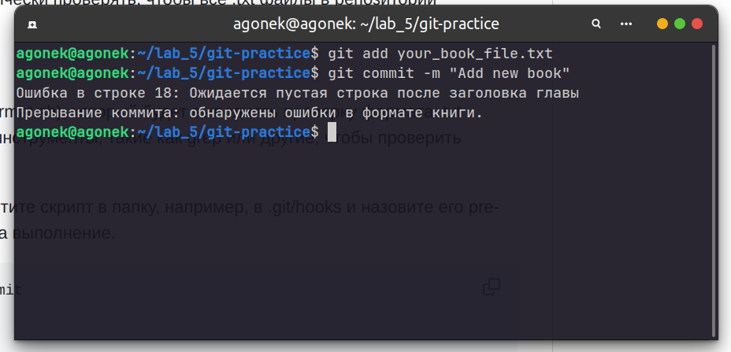

Меняем файл (делаем пустой 18 строку). 

> 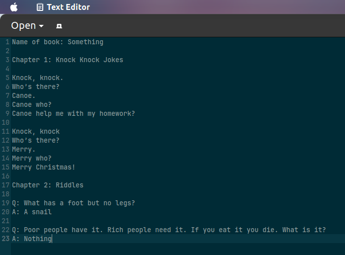

Добавляем файл в индекс и делаем коммит. Бинго! Теперь всё работает.

> 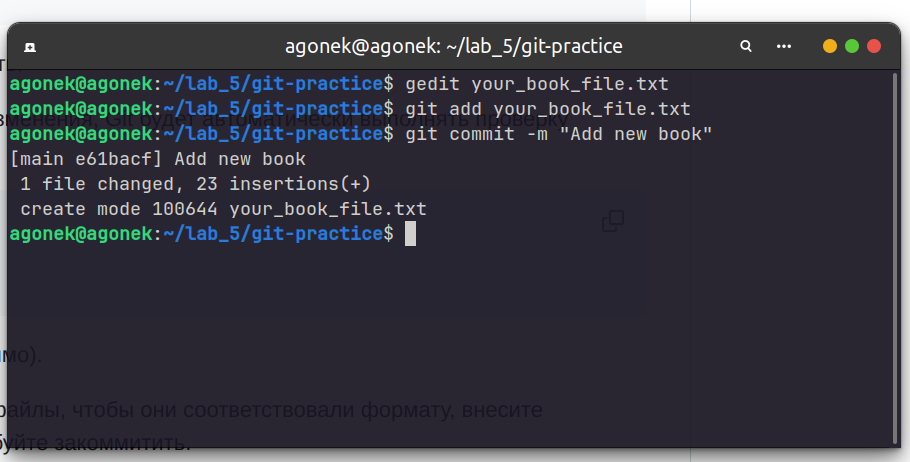
## Использование Git Flow в проекте
https://bitworks.software/2019-03-12-gitflow-workflow.html
Удостоверимся, что мы находимся в корне репозиторию и запустим инициализацию git flow.

> 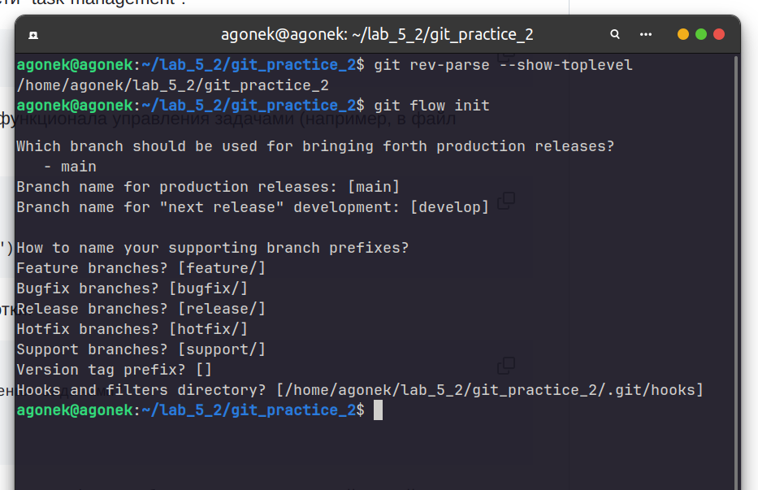

В репозиторий был добавлен файл `task_manager.py` с некоторыми функциями. Создана ветка для добавления новой фичи.

> 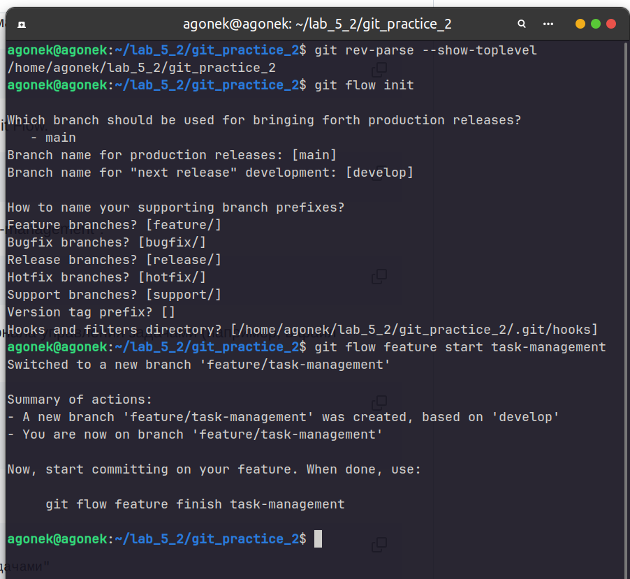

В ветке feature/task_manager был изменён файл с новой функцией `create_task` и дополненным блоком `action`.

> 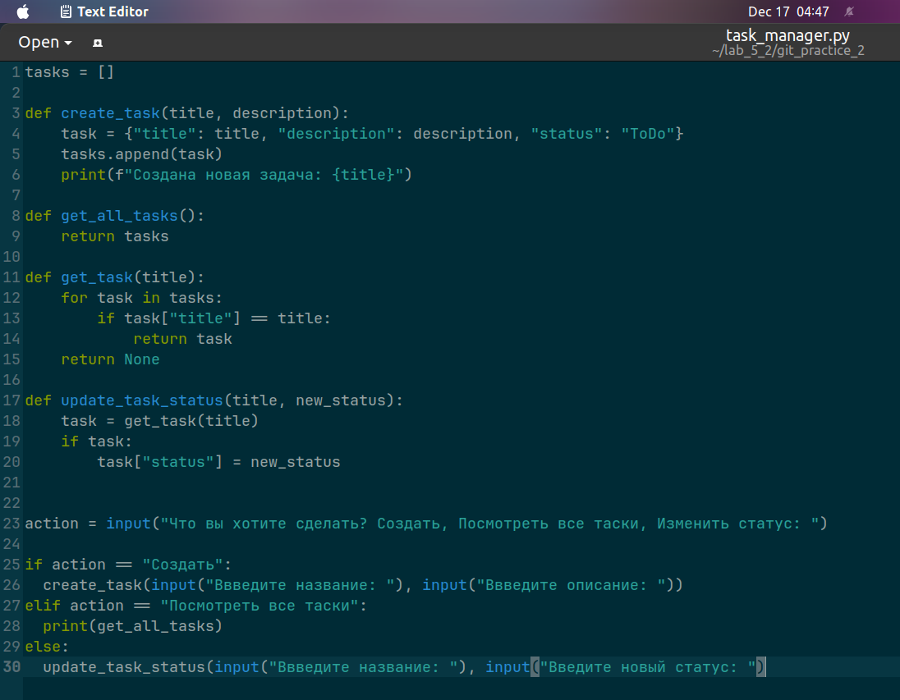

Файл добавлен в индекс, закоммичен. Фича завершена и обьединена с веткой `develop`.

> 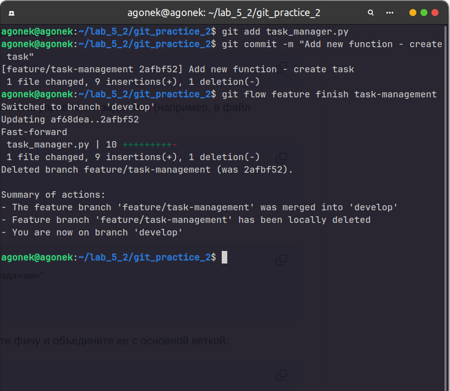

Вносим изменения, связанные с релизом (файл с номером релиза).

> 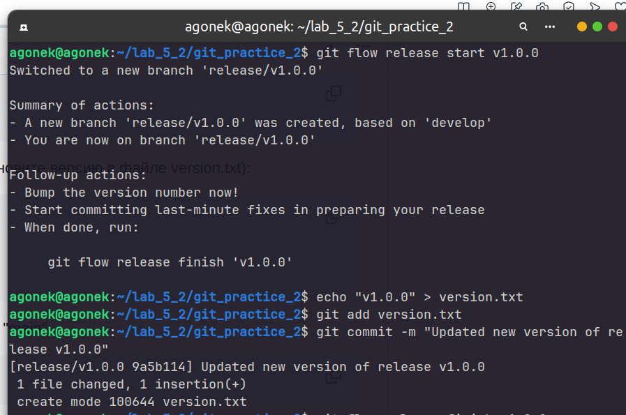

Завершение релиза. Слияние веток с помощью
`git checkout main`
`git pull origin main`
`git push origin main`

> 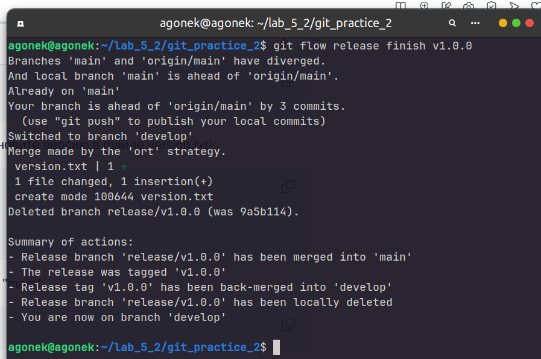

Cмоделируем ситуацию, когда в процессе эксплуатации проекта была выявлена критическая ошибка (цикл должен проходиться с нуля, а не с 1): 

> 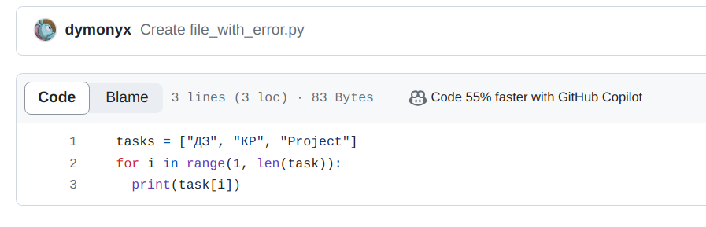

Создаем hotfix, исправляем ошибку.

> 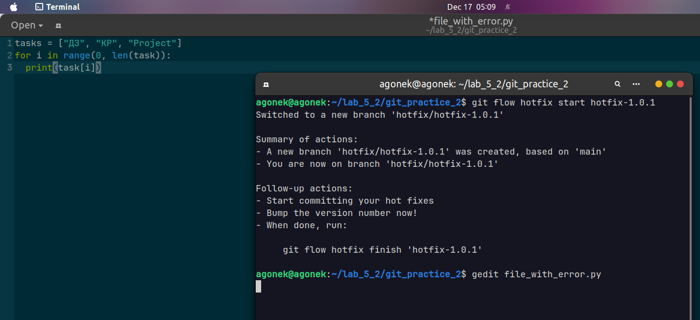

Добавляем изменения, коммитим:

> 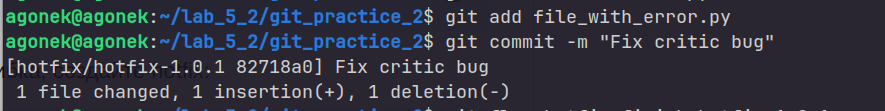

Завершаем хотфикс и сливаем всё в главную ветку.

> 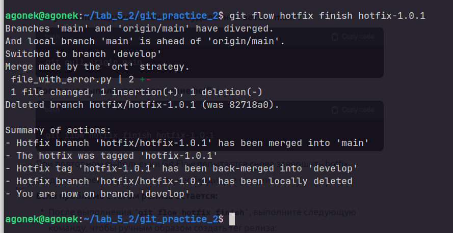

Пушим изменения в удалённый репозиторий.

> 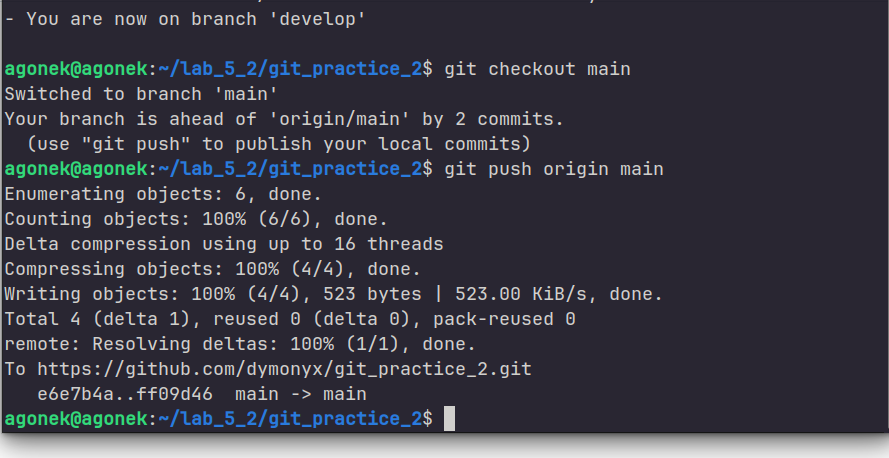

